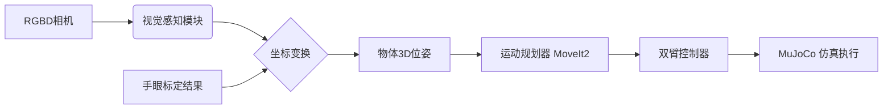

# 🤖 ROS2 + OpenArm 双臂机器人视觉抓取系统


本项目基于 **ROS2 (Humble/Foxy)**、**OpenArm 双臂机器人模型**、**MuJoCo 仿真环境** 与 **仿真深度相机**，实现从 **物体检测 → 三维定位 → 手眼标定 → 双臂轨迹规划 → 抓取执行** 的完整智能机器人系统。**本项目为纯仿真项目，无需实物硬件。**

---

## 📖 目录

- [项目简介](#-项目简介)
- [Git 分支工作流规范](#-git-分支工作流规范)
- [系统架构](#-系统架构)
- [团队分工](#-团队分工)
- [环境依赖](#-环境依赖)
- [安装与构建](#-安装与构建)
- [系统运行说明](#-系统运行说明)
- [项目目录结构](#-项目目录结构)
- [成果展示](#-成果展示)

---

## 📘 项目简介

本系统旨在通过 **纯仿真方式**，完成双臂机器人的闭环抓取任务。主要流程如下：

1. **环境感知**：仿真深度相机采集 RGB/Depth 数据，进行图像与点云预处理。
2. **视觉识别**：使用传统 CV 或深度学习模型进行物体检测与分割。
3. **三维定位**：将像素坐标转换为相机坐标，并进一步转换至机器人基座坐标系。
4. **系统标定**：基于 Tsai-Lenz 算法实现 $AX=XB$ 手眼标定。
5. **运动规划**：利用 MoveIt2 进行双臂避障轨迹规划与协作控制。
6. **抓取执行**：设计抓取状态机，控制末端夹爪完成 "接近-抓取-提升-放置" 流程。
7. **仿真验证**：在 MuJoCo 环境中验证物理交互与抓取稳定性。

---

## 🌳 Git 分支工作流规范

为了确保多人协作的代码稳定性，本项目严格采用 **简化版 GitFlow 工作流**。所有成员请务必遵守：

| 分支名称 | 说明 | 权限 |
| :--- | :--- | :--- |
| **`main`** | **主分支（发布版）**。<br>仅存放经过完整测试、稳定且可直接运行的代码。**禁止直接 commit 到此分支。** | 仅限 Merge |
| **`dev`** | **开发主线**。<br>所有最新功能的汇聚地。所有新功能开发必须基于此分支创建。 | 协作开发 |
| **`feature-xxx`** | **功能分支**。<br>个人或小组针对特定任务创建的分支（如 `feature-vision`）。<br>开发完成后，需通过 **Pull Request** 合并回 `dev`。 | 个人开发 |

**开发流程示例：**
```bash
# 1. 切换到 dev 并拉取最新代码
git checkout dev
git pull origin dev

# 2. 创建自己的功能分支
git checkout -b feature-my-task

# ... 编写代码，提交 commit ...

# 3. 推送并请求合并
git push origin feature-my-task
# (然后在 GitHub 网页端发起 Pull Request 合并到 dev)
```

---

## 🏗 系统架构



*(详细架构图可见 `docs/system_architecture.png`)*

---

## 👥 团队分工

### 分工概览

| 成员 | 角色 | 负责模块 | 主要资源 |
| :--- | :--- | :--- | :--- |
| **梁晋浩** | **环境与仿真工程师** | URDF/MuJoCo | `openarm_description`、`openarm_ros2/openarm_bringup`、`openarm_moveit_config` |
| **林达尔** | **视觉与手眼标定工程师** | Perception/Calibration | `openarm_description`（相机/TF）、`openarm_moveit_config/config/sensors_3d.yaml` |
| **林嘉锴** | **运动规划与控制工程师** | Motion Control | `openarm_moveit_config`、`openarm_ros2/openarm_bringup`、`openarm_control` |
| **陈信安** | **系统集成与论文统稿** | Integration/Documentation | `openarm_ros2/openarm_bringup`、全局实验数据 |

---

### 详细任务与实现要点

#### 梁晋浩：环境与仿真建设

**核心任务：**
- 扩展 URDF/Xacro：在 `openarm_description/urdf/robot/openarm_robot.xacro` 中挂载桌子、苹果/香蕉模型；为相机预留安装位（link + fixed joint、惯性占位）
- 仿真场景：编写 MuJoCo 或 Gazebo/ros_gz 配置，加载机器人+桌面+物体；参考 `openarm_ros2/openarm_bringup` 模板新建/修改 launch
- TF 管理：核对 `world/base/camera/ee/target` TF 连续性，提供 RViz 截图

**交付物：**
- 场景 URDF/XML 文件
- Launch 启动文件
- RViz/MuJoCo 截图
- 论文"机器人模型扩展""仿真环境搭建"素材
<<<<<<< HEAD
- 分工声明
=======
>>>>>>> b1d6204 (完成mujoco中机械臂的更新)

---

#### 林达尔：视觉感知与手眼标定

**核心任务：**
- **相机集成**：在预留位添加深度相机 link/joint，生成 TF；必要时编写内参/噪声占位
- **手眼标定**：选择"眼在手上/外"，使用 `eye_hand_calibration` 或自写脚本进行多姿态采样，输出外参与误差表，保存数据与脚本
- **检测与坐标变换**：实现颜色/形状或轻量模型检测；完成 `camera_frame → base_frame` 转换并验证精度

**交付物：**
- 标定脚本 + 误差报告
- 检测节点代码
- 定位误差数据与截图
- 论文"手眼标定""视觉检测与定位"素材

---

#### 林嘉锴：运动规划与控制

**核心任务：**
- **MoveIt 配置与规划**：基于 `openarm_moveit_config` 选择/调优 OMPL 规划器，设置约束与时间参数化
- **抓取流程**：生成预抓取/抓取/撤离姿态；使用 `openarm_control/arm_controller.py` 或 MoveIt action 执行轨迹，增加夹爪开合逻辑
- **双臂策略**：若使用双臂，结合 `openarm_ros2/openarm_bringup/launch/openarm.bimanual.launch.py` 的命名空间与控制器；不稳定时先单臂

**交付物：**
- 抓取/控制节点代码
- 轨迹平滑与成功率数据
- 实验曲线图
- 论文"抓取规划与控制"与"实验结果"素材

---

#### 陈信安：系统集成、实验与论文统稿

**核心任务：**
- **集成与 Launch**：编写总控 launch，将相机/标定/感知/规划/控制串联；绘制系统框图（Topic/Service/TF/数据流）
- **实验管理**：统一数据表（标定误差、定位误差、抓取成功率），收集截图/视频
- **仓库与流程**：负责 GitHub 仓库管理与分支策略，建立 README/CI（可选）、提交规范，合并各成员成果
- **论文与提交**：撰写摘要/引言/实验分析/总结，合并各成员章节；统一格式、图表编号、参考文献；制作 ≤8 分钟演示视频（录屏/剪辑）与旁白脚本；整理代码仓库与提交包

**交付物：**
- 总控 launch 文件
- 系统框图
- 实验表格与统计图
- 最终 PDF 论文
- 演示视频与链接
:
=======
- 分工声明

- 仓库发布（tag/release）

---

## 📦 环境依赖

### 必要软件

* **OS**: Ubuntu 22.04 (Humble) / 20.04 (Foxy)
* **ROS2**: Humble / Foxy
* **Simulator**: MuJoCo 2.x / `mujoco_ros` / `ros_gz`
* **Libraries**: MoveIt2, PCL, OpenCV

### 安装命令示例

```bash
# 安装 ROS2 依赖
sudo apt install ros-${ROS_DISTRO}-vision-msgs ros-${ROS_DISTRO}-pcl-ros ros-${ROS_DISTRO}-moveit

# 安装 Python 算法库
pip install opencv-python numpy transforms3d scipy
```

---

## ⚙ 安装与构建

```bash
# 1. 创建工作空间
mkdir -p ~/ros2_openarm_ws/src
cd ~/ros2_openarm_ws/src

# 2. 克隆本仓库 (确保在 dev 或 main 分支)
git clone <本仓库GitHub地址>

# 3. 安装依赖
cd ..
rosdep install --from-paths src -r -y --ignore-src

# 4. 编译
colcon build --symlink-install

# 5. 配置环境变量
source install/setup.bash
```

---

## 🚀 系统运行说明

### 1. 启动完整仿真系统 (System Bringup)

这将启动 MuJoCo 环境、机器人模型、Rviz 可视化以及所有基础节点。

```bash
ros2 launch system_bringup mujoco_full_system.launch.py
```

### 2. 运行视觉感知任务

启动仿真相机驱动与识别节点，发布物体坐标。

```bash
ros2 launch perception perception.launch.py
# 查看检测结果
ros2 topic echo /detected_objects
```

### 3. 执行手眼标定

采集数据并计算 $AX=XB$ 变换矩阵。

```bash
# 步骤1: 采集标定样本
ros2 run calibration collect_samples
# 步骤2: 计算矩阵
ros2 run calibration compute_hand_eye
```

*结果将保存在 `results/calibration_result.yaml`*

### 4. 执行抓取任务

启动状态机，执行 "识别-规划-抓取" 闭环。

```bash
ros2 launch motion_control grasp.launch.py
```

---

## 📁 项目目录结构

```text
ros2-openarm-project/
├── launch/                   # 全局启动文件
├── urdf/                     # 机器人与环境描述文件 (.xacro)
├── mujoco/                   # MuJoCo 仿真配置 (.xml)
├── openarm_description/      # OpenArm 机器人描述文件
│   ├── urdf/                 # URDF/Xacro 文件
│   ├── meshes/               # 3D 模型文件
│   └── config/               # 配置文件
├── openarm_env_description/  # 环境描述（桌子、物体等）
├── openarm_env_bringup/      # 环境启动包
├── perception/               # 视觉感知功能包
│   ├── perception/           # 视觉算法源码
│   └── config/               # 识别参数
├── calibration/              # 手眼标定功能包
│   ├── calibration/          # 标定与求解脚本
│   └── results/              # 标定结果文件
├── motion_control/           # 运动控制功能包
│   ├── motion_control/       # 规划与状态机源码
│   └── config/               # MoveIt配置
├── system_bringup/           # 系统集成启动包
├── docs/                     # 项目文档与图纸
├── results/                  # 实验数据记录
└── README.md                 # 项目说明书
```

---

## 🎬 成果展示

*在此处添加演示材料，建议使用 GIF 或视频链接*

<<<<<<< HEAD
* **物体检测效果**：
* **仿真抓取演示**：
=======
  * **物体检测效果**：
  * **仿真抓取演示**：
>>>>>>> b1d6204 (完成mujoco中机械臂的更新)
* **标定误差分析**：[点击查看详细报告](results/calibration_error.csv)

---

## 📚 参考文献

1. ROS2 Documentation: https://docs.ros.org/
2. MoveIt2 Tutorials: https://moveit.picknik.ai/
3. Tsai, R. Y., & Lenz, R. K. (1989). A new technique for fully autonomous and efficient 3D robotics hand/eye calibration.

---

## 📝 License

本项目遵循 MIT License。仅用于课程设计与学术交流。
